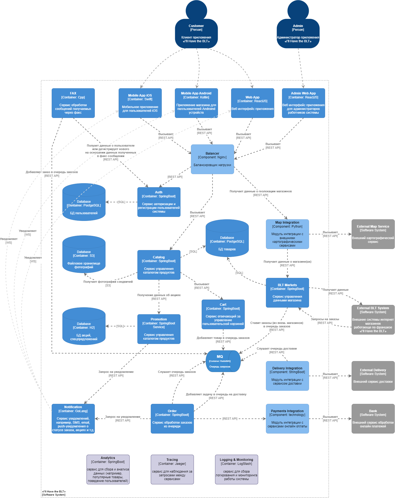

# Техническое задание

## Создание интернет магазина «**I\'ll Have the BLT**»

Национальная сеть сэндвич-магазинов хочет внедрить возможность
«отправить заказ по факсу», но через Интернет (в дополнение к
существующему сервису заказов по факсу).

- **Пользователи:** тысячи, возможно, в будущем миллионы.

- Требования:

  - Пользователи будут размещать заказ, после чего им будет назначено
    время для получения сэндвича и указаны направления до магазина (с
    интеграцией нескольких внешних картографических сервисов, включая
    информацию о трафике).
  - Если магазин предлагает услугу доставки, отправить водителя с
    сэндвичем к пользователю.
  - Доступность с мобильных устройств.
  - Предложение национальных ежедневных акций/специальных предложений.
  - Предложение локальных ежедневных акций/специальных предложений.
  - Прием оплаты онлайн или при получении/доставке.

- **Дополнительный контекст:**

  - Магазины сэндвичей работают по франшизе, и каждый принадлежит
    разному владельцу.
  - Материнская компания планирует в ближайшем будущем расшириться за
    границу.
  - Корпоративная цель --- нанимать недорогую рабочую силу для получения
    максимальной прибыли.

# Пользовательские сценарии

## Сценарий 1: Поиск и заказ сэндвича с самовывозом

**Есть** интернет-магазин «I\'ll Have the BLT».

**И** есть клиент.

**И** клиент вводит в поиск «Классический BLT сэндвич».

**Тогда** появляется список сэндвичей, подходящих к запросу.

**И** в карточке товара он видит:

1.  Название сэндвича (например, «Классический BLT»).
2.  Изображение сэндвича.
3.  Цену (например, 350 рублей).
4.  Скидку (если удовлетворяется одно из условий: сегодня проводится
    специальная рекламная акция ИЛИ пользователь авторизован и действуют
    локальные предложения).
5.  Схожие товары, которые часто заказывают вместе (например, «Картофель
    фри» или «Напиток Coca-Cola»).

**И** выбирает способ оплаты: онлайн или при получении.

## Сценарий 2: Поиск ближайшего магазина (Самовывоз)

**Есть** интернет-магазин «I\'ll Have the BLT».

**И** есть авторизованный клиент.

**И** клиент уже сделал заказ

**И** клиент выбирает опцию «Самовывоз».

**Тогда** система запрашивает разрешение на доступ к геолокации.

**И** после получения данных система показывает:

- Список ближайших магазинов.
- Время работы каждого магазина.
- Примерное время приготовления заказа (например, «15 минут»).

**И** клиент выбирает ближайший магазин и оформляет заказ.

## Сценарий 3: Заказ сэндвича с доставкой

**Есть** интернет-магазин «I\'ll Have the BLT».

**И** есть авторизованный клиент.

**И** клиент вводит в поиск «Классический BLT сэндвич».

**Тогда** появляется список сэндвичей, подходящих к запросу.

**И** клиент добавляет в корзину товары.

**И** клиент выбирает опцию «Доставка».

**Тогда** система запрашивает адрес доставки.

**И** после ввода адреса клиент видит:

- Список доступных магазинов для доставки.
- Примерное время доставки (например, «30-40 минут»).
- Минимальную сумму заказа для доставки (например, «500 рублей»).

**Тогда** система показывает итоговую сумму с учетом доставки и
предлагает способы оплаты (онлайн или наличными при получении).

**И** выбирает способ оплаты: онлайн или при получении.

## Сценарий 4: Отслеживание статуса заказа

**Есть** интернет-магазин «I\'ll Have the BLT».

**И** есть авторизованный клиент.

**И** клиент уже сделал заказ с доставкой

**Тогда** клиент переходит в раздел «Мои заказы».

**И** система показывает:

- Номер заказа.
- Текущий статус (например, «Готовится», «В пути», «Доставлен»).
- Примерное время доставки (например, «Осталось 10 минут»).
- Контактные данные курьера (если заказ уже в пути).

**И** клиент может связаться с курьером или магазином, если возникнут
вопросы.

## Сценарий 5: Использование акции

**Есть** интернет-магазин «I\'ll Have the BLT».

**И** есть авторизованный клиент.

**И** клиент видит баннер с акцией: «Сэндвич BLT со скидкой 20%».

**Тогда** клиент нажимает на баннер.

**И** система показывает карточку товара с:

- Названием сэндвича (например, «BLT сэндвич»).
- Изображением сэндвича.
- Ценой со скидкой (например, «280 рублей вместо 350»).
- Условиями акции (например, «Акция действует до 31 октября»).
- Схожие товары, которые часто заказывают вместе (например, «Картофель
  фри» или «Напиток Coca-Cola»).

**И** клиент добавляет сэндвич в корзину.

**И** выбирает способ оплаты: онлайн или при получении.

## Сценарий 6: Отмена заказа

**Есть** интернет-магазин «I\'ll Have the BLT».

**И** есть авторизованный клиент.

**И** клиент сделал заказ, но передумал.

**Тогда** клиент переходит в раздел «Мои заказы».

**И** система показывает:

- Номер заказа.
- Текущий статус (например, «Готовится»).
- Кнопку «Отменить заказ».

**И** клиент нажимает «Отменить заказ».

**Тогда** система запрашивает подтверждение отмены.

**И** после подтверждения система отменяет заказ и возвращает деньги
(если оплата была онлайн).

# Общая схему взаимодействия сервисов



# Назначение сервисов и их зоны ответственности

## Основные сервисы Frontend:

1.  Mobile App iOS

  - **Назначение**: Предоставить пользователям iOS удобный интерфейс для
    заказа сэндвичей.

  - **Описание**: Мобильное приложение для iOS, которое позволяет
    пользователям просматривать меню, делать заказы, отслеживать статус
    заказа и получать уведомления.

  - Зона ответственности:

    - Отображение каталога товаров.
    - Управление корзиной.
    - Оформление заказов.
    - Интеграция с сервисом уведомлений.

2.  **Mobile App Android**

  - **Назначение**: Предоставить пользователям Android удобный интерфейс
    для заказа сэндвичей.

  - **Описание**: Мобильное приложение для Android с аналогичным
    функционалом, как и у iOS-приложения.

  - Зона ответственности:

    - Отображение каталога товаров.
    - Управление корзиной.
    - Оформление заказов.
    - Интеграция с сервисом уведомлений.

3.  **WebApp**

  - **Назначение**: Веб-версия приложения для клиентов магазина.

  - **Описание**: Веб-интерфейс, который дублирует функционал мобильных
    приложений.

  - Зона ответственности:

    - Отображение каталога товаров.
    - Управление корзиной.
    - Оформление заказов.
    - Интеграция с сервисом уведомлений.

4.  **Admin WebApp**

  - **Назначение**: Управление системой для администраторов и
    сотрудников магазинов.

  - **Описание**: Веб-интерфейс для управления заказами, акциями,
    каталогом товаров и данными магазинов.

  - Зона ответственности:

    - Управление каталогом товаров.
    - Управление акциями и спец предложениями.
    - Мониторинг заказов.
    - Управление данными магазинов.

## Основные сервисы Backend:

1.  **Balancer**

  - **Назначение**: Обеспечивает балансировку запросов для повышения
    отказоустойчивости и производительности системы.

  - Зона ответственности:

    - Распределение входящих запросов.
    - Обеспечение отказоустойчивости.

2.  **Auth**

  - **Назначение**: Авторизация и регистрация пользователей.

  - **Описание**: Управление учётными данными пользователей,
    аутентификация и выдача токенов.

  - Зона ответственности:

    - Регистрация и аутентификация пользователей.
    - Управление ролями (пользователь, администратор).
    - Обеспечение безопасности данных.

3.  **Catalog**

  - **Назначение**: Управление каталогом товаров.

  - **Описание**: Хранение и предоставление информации о товарах
    (название, описание, цена, изображения).

  - Зона ответственности:

    - Управление данными о товарах.
    - Интеграция с S3 для хранения изображений.

4.  **Cart**

  - **Назначение**: Управление корзиной пользователя.

  - **Описание**: Временное хранение товаров, выбранных пользователем,
    перед оформлением заказа.

  - Зона ответственности:

    - Добавление/удаление товаров в корзину.
    - Расчет итоговой суммы.
    - Интеграция с MQ для поставки в очередь заказов.

5.  **Promotion**

  - **Назначение**: Управление акциями и спецпредложениями.

  - **Описание**: Приём заказов, их обработка и передача в службу
    доставки.

  - Зона ответственности:

    - Управление акциями.
    - Применение скидок к заказам.

6.  **Order**

  - **Назначение**: Обработка заказов.

  - **Описание**: Приём заказов, их обработка и передача в службу
    доставки.

  - Зона ответственности:

    - Создание и управление заказами.
    - Интеграция с MQ для обработки очередей.

7.  **BLT Markets**

  - **Назначение**: Управление данными офлайн-магазинов.

  - **Описание**: Хранение информации о магазинах (адреса, время работы,
    доступные услуги).

  - Зона ответственности:

    - Управление данными магазинов.
    - Интеграция с картографическими сервисами.
    - Интеграция с MQ для передачи заказов с случае обработки запросов
      на «самовывоз»

8.  **FAX** --- сервис обработки сообщений получаемых через факс. Я
    решил его указать на схеме, так как, судя по фразе "in addition to
    their current fax-in service" («в дополнение к текущему
    факс-сервису»), я предположил, что этот сервис должен сохраниться в
    системе.

  - Зона ответственности:

    - Приём и обработка факсов.
    - Добавление товаров в корзину.
    - Интеграция с MQ для поставки в очередь заказов.

9.  **Notification**

  - **Назначение**: Отправка уведомлений пользователям.

  - **Описание**: Сервис уведомлений, например, SMS, email,
    push-уведомления о статусе заказа, акциях и т. д.

  - **Зона ответственности:**

    - Отправка уведомлений.

## Сервисы взаимодействия с внешними системами:

1.  **Delivery Integration**

  - **Назначение**: Интеграция с сервисом доставки.

  - **Описание**: Передача заказов в службу доставки и получение статуса
    доставки.

  - **Зона ответственности:**

    - Передача данных о заказах.
    - Получение статуса доставки.

2.  **Payments Integration**

  - **Назначение**: Интеграция с платежными системами.

  - **Описание**: Обработка онлайн-платежей.

  - **Зона ответственности:**

    - Приём платежей.
    - Возврат средств.

3.  **Map Integration**

  - **Назначение**: Интеграция с картографическими сервисами.

  - **Описание**: Построение маршрутов и расчёт времени доставки.

  - **Зона ответственности:**

    - Получение данных о маршрутах.
    - Получение данных о геолокации магазинов (интеграция с BLT
      Markets.)

## Базы данных

1.  Основная БД для товаров и данных магазина
2.  БД пользователей
3.  БД акций и спец предложений
4.  S3 хранилище бинарных объектов, таких как фотографии сэндвичей
5.  MQ сервис очередей для обработки поступающих заказов и задач к
    службе доставки

## Служебные сервисы

1.  **Analytics**

  - **Назначение**: Сбор и анализ данных.

  - **Описание**: Анализ поведения пользователей, популярности товаров и
    эффективности акций.

  - **Зона ответственности:**

    - Сбор данных.
    - Генерация отчётов.

2.  Tracing

  - **Назначение**: Наблюдение за запросами между сервисами.

  - **Описание**: Отслеживание выполнения запросов для диагностики
    проблем.

  - **Зона ответственности:**

    - Логирование запросов.
    - Построение цепочек выполнения запросов.

3.  **Logging & Monitoring**

  - **Назначение**: Сбор логов и мониторинг работы системы.

  - **Описание**: Отслеживание состояния системы и выявление ошибок.

  - **Зона ответственности:**

    - Сбор логов.
    - Мониторинг производительности.

# Контракты взаимодействия

## 1. Взаимодействие Frontend и Backend 

### Mobile App iOS/Android/WebApp \<==\> Auth

Запрос на регистрацию:

POST `/api/auth/register`
```json
{
  "email": "ivanov@example.ru",
  "lastName": "Иванов",
  "firstName": "Иван",
  "patronymic": "Иванович",
  "gender": "male",
  "dob": "1984-06-28",
  "password": "securepassword",
  "login": "ivan_ii"
}
```

Запрос на авторизацию:

POST `/api/auth/login`
```json
{
  "email": "ivanov@example.ru",
  "password": "securepassword"
}
```

Ответ:
```json
{
  "userId": "12345",
  "token": "jwt_token"
}
```

### Mobile App iOS/Android/WebApp \<==\> Catalog 

Запрос на получения списка товаров

GET `/api/catalog?name=Standard&page=1&size=1&sort=name,ASC`

Ответ
```json
{
  "totalFounded": 1812,
  "products": [
    {
      "id": "1",
      "name": "BLT Sandwich",
      "price": 350,
      "imageBase64": "aHR0cHM6Ly9zMy5leGFtcGxlLmNvbS9ibHQuanBn"
    }
  ]
}
```

### Mobile App iOS/Android/WebApp \<==\> Map Integration

Запрос на получение списка ближайших магазинов:

POST `/api/maps/markerts`
```json
{
  "ll": "15.669600,-87.142300"
  "destination": "ул.Виноградная,д.3"
}
```

Ответ:
```json
{
  "distance": "5 км",
  "duration": "15 минут",
  "route": "..."
}
```

## 2. Взаимодействие Backend-сервисов

### Catalog \<==\> Cart

Запрос на добавление товара в корзину:

POST `/api/cart/add`
```json
{
  "userId": 12345,
  "productId": 165,
  "quantity": 2
}
```

Ответ:
```json
{
  "cartId": 67890,
  "discount": "10%"
  "totalPrice": 630
}
```

### Cart \<=MQ=\> Order

Запрос на создание заказа, передаваемый через сообщения брокера MQ
```json
{
  "userId": 12345,
  "items": [
    {
      "productId": 165,
      "quantity": 2
    }
  ],
  "deliveryAddress": "ул.Виноградная,д.3"
}
```

### Order \<=MQ=\> Delivery Integration

Запрос на создание задачи доставки:
```json
{
  "orderId": "54321",
  "deliveryAddress": "ул.Виноградная,д.3",
  "pickupAddress": "ул.Тенистая,д.7,стр.2"
}
```

### Order \<==\> Payments Integration 

Запрос на обработку платежа:

POST `/api/payments/process`
```json
{
  "orderId": 54321,
  "amount": 700,
  "paymentMethod": "credit_card",
  "cardDetails": {
    "number": "4111111111111111",
    "expiry": "12/25",
    "cvv": "123"
  }
}
```


Ответ
```json
{
  "paymentId": "112233",
  "status": "Success"
}
```

### Order \<==\> Notification 

POST `/api/notification/send`
```json
{
  "userId": 12345,
  "message": "Ваш заказ #54321 в процессе приготовления.",
  "type": "push"
}
```