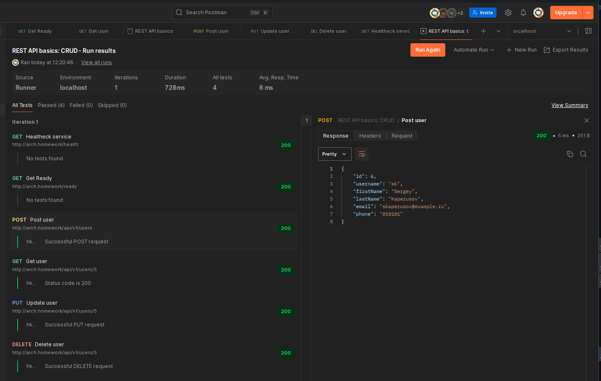

# Работа с Helm-ом // ДЗ 

Написание простейшего RESTful CRUD по созданию, удалению, просмотру и обновлению пользователей.
И формирование helm чартов для разворачивания и запуска сервис в Kubernetes.


## Краткое описание выполненной работы: 

1. На основе предоставленого в ДЗ [примера API](https://app.swaggerhub.com/apis/otus55/users/1.0.0) 
я сгенерировал исходный код небольшого CRUD приложения на go. Для генерации я использовал Swagger Codegen.

2. В полученный код добавил методы /health и /ready, чтобы использовать их в liveness и readness пробах

3. Использую команду `helm create app` создал чарт-шаблоны для приложения. Они находятся в папке `charts/app`

4. Затем, через helm добавил в свой k8s кластер postgresql из репозитория bitnamicharts
([ссылка на ArtifactHUB](https://artifacthub.io/packages/helm/bitnami/postgresql))

5. Начальные миграции приложение делает самостоятельно при старте

6. Настройки приложения для подключния к БД задаются в файле `application.yaml` (`hw04-helm/charts/app/templates/configmap.yaml`), 
а логин и рароль в переменных окружения, которые формируется в secrets: `hw04-helm/charts/app/templates/secret.yaml`

Для их чтения можно воспользоваться командой:
```bash
kubectl get secret -n otus db-secret -o jsonpath="{.data.DB_USERNAME}" | base64 -d
kubectl get secret -n otus db-secret -o jsonpath="{.data.DB_PASSWORD}" | base64 -d
```

Чтобы механизмы инициализации кредов в приложении и с Postgres сделать схожими 
я взял часть структуры `values.yaml` из чарта Postgres и вынес его в отдельный
файл `hw04-helm/charts/db/values.yaml`

Но так как, я считаю хранение такого рада файлов в git неправильным, то в репозитории
лежат лишь sample файлы: 
 - values.yaml.sample  
 - application.sample.yaml (этот файл - пример конфигурации, который можно использовать для локального запуска приложения)

Получить рабочие конфигурации можно или руками, скопировав файлы и отредактировав их,
или воспользоваться скриптом `setup.sh`.

Для инсталляции приложения нужно выполнить следующие команды: 
```bash
# Добавление helm репозитория Bitnami (если его нет) 
helm repo add bitnami https://charts.bitnami.com/bitnami

# Инсталляция БД
helm install db --create-namespace --namespace otus \
      oci://registry-1.docker.io/bitnamicharts/postgresql \
      --values charts/db/values.yaml

# Дождаться, когда сервис стартует

# Инсталляция приложения
helm upgrade --install app --create-namespace --namespace otus \
      ./charts/app \
      --values charts/app/values.yaml \
      --values charts/db/values.yaml
```

Для большего удобства развертывания приложения лучше воспользоваться утилитой GNU make. 
В Makefile есть готовый task для развёртывания всех необходимых сервисов:

```bash
make helm-install-all
```

## Проверка работоспособности

### Postman Collection

hw04-helm/REST API basics - CRUD.postman_collection.json



[Результаты выполнения тестов эккспортированные в JSON](REST%20API%20basics%20-%20CRUD.postman_test_run.json)

### Swagger UI

Также, приложение поддерживает работу с API через встроенный Swagger UI: 

http://arch.homework/swagger-ui/index.html


## Дополнительные команды для работы с PostrgreSQL:

Подключение к БД, через консольное приложение pgsql, с инсталляцией его в кластер
```bash
export POSTGRES_PASSWORD=$(kubectl get secret --namespace otus db-postgresql -o jsonpath="{.data.password}" | base64 -d)
kubectl run db-postgresql-client --rm --tty -i --restart='Never' --namespace otus --image docker.io/bitnami/postgresql:17.4.0-debian-12-r17 --env="PGPASSWORD=$POSTGRES_PASSWORD" \
      --command -- psql --host db-postgresql -U db_user -d users -p 5432
```

Проброс порта на хост
```bash
kubectl port-forward --namespace otus svc/db-postgresql 5432:5432 \
& PGPASSWORD="$POSTGRES_PASSWORD" psql --host 127.0.0.1 -U db_user -d users -p 5432
```