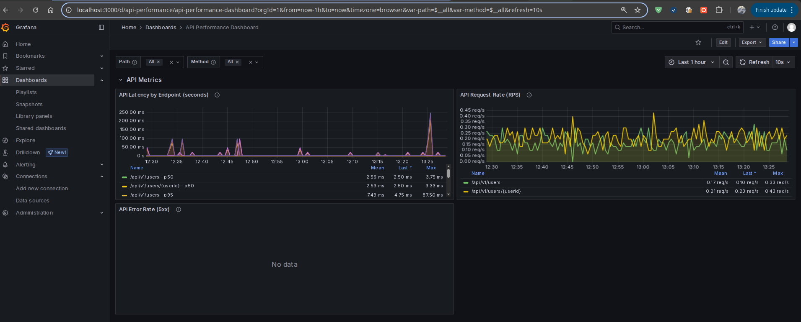

# Prometheus. Grafana // ДЗ 

Инструментировать сервис из прошлого задания метриками в формате Prometheus с помощью библиотеки для вашего фреймворка и ЯП.

## Краткое описание выполненной работы: 


### 1. Установка приложения 

Используется helm из предыдущего ДЗ (../hw04-helm), и новый docker образ 
(`--values charts/app/values.yaml` => [kaperusov/otus-app-user-crud:hw05](https://hub.docker.com/repository/docker/kaperusov/otus-app-user-crud/tags)),
в котором [добавлены метрики prometheus](../hw04-helm/internal/prometheus.go):

```bash
helm upgrade --install app --create-namespace --namespace otus \
           ../hw04-helm/charts/app/ \ 
  --values ../hw04-helm/charts/db/values.yaml \
  --values charts/app/values.yaml
```

В результате, метрики приложения должны быть доступны по адресу: http://arch.homework/prometheus
  

### 2. Установка Prometheus и Grafana

Для начала надо проверить, что необходимый metrics-server addon для minikube включен:
```bash
minikube addons list
```
При необходимости включить: 
```bash
minikube addons enable metrics-server
```

Для Prometheus и Grahana, я воспользовался helm чартом, который устанавливает весь стек: Prometheus + ServiceMetric (оператор) + Grafana
```bash
helm repo add prometheus-community https://prometheus-community.github.io/helm-charts
helm repo update 
helm -n otus install stack prometheus-community/kube-prometheus-stack -f prometheus/values.yaml
```

Для связи метрик приложения к Prometheus необходимо создать ServiceMonitor, 
для этого применяем следующий манифест:
```bash
kubectl apply -f service-monitor.yaml
```

Для входа в UI Prometheus:
```bash
export PROM=$(kubectl get pods --namespace otus -l "app.kubernetes.io/name=prometheus,app.kubernetes.io/instance=stack-kube-prometheus-stac-prometheus" -o jsonpath="{.items[0].metadata.name}")
kubectl --namespace otus port-forward $PROM --address 0.0.0.0 9090
```

Для входа в UI Grahana:
```bash
export GRAF=$(kubectl get pods --namespace otus -l "app.kubernetes.io/name=grafana,app.kubernetes.io/instance=stack" -o jsonpath="{.items[0].metadata.name}")
kubectl --namespace otus port-forward $GRAF --address 0.0.0.0 3000
```

Пароль к Grahana: 
```bash
kubectl get secret --namespace otus stack-grafana -o jsonpath="{.data.admin-password}" | base64 --decode ; echo
```


### 3. Генерим трафик: 

Самый простой вариант, можно использовать консольное приложение `hey`, например: 

  hey -z 5m -q 5 -m GET -H "Accept: text/html" http://arch.homework/api/v1/users/1

Но я решил использовать ИИ для генерации [bash скрипта](./traffic.sh), 
который на основе файла [Postman файла, из предыдущего задания,](../hw04-helm/REST%20API%20basics%20-%20CRUD.postman_test_run.json) с тестовыми запросами к API приложения, генерирует случайным образом запросы ко всем методам приложения в случайном порядке. 

Запуск:
  
  ./traffic.sh


### 4. PromQL запросы 

**Задание** 

> Сделать дашборд в Графане, в котором были бы метрики с разбивкой по API методам:
>
> 1. Latency (response time) с квантилями по 0.5, 0.95, 0.99, max
> 2. RPS
> 3. Error Rate - количество 500ых ответов

**Решение**

1. Расчёт Latency (response time) с квантилями по 0.5, 0.95, 0.99, max

```promql
# Медиана (50-й перцентиль)
histogram_quantile(0.5, sum(rate(http_response_time_seconds_bucket{path=~"/api/v1/.*"}[1m])) by (le, method, path))

# 95-й перцентиль
histogram_quantile(0.95, sum(rate(http_response_time_seconds_bucket{path=~"/api/v1/.*"}[1m])) by (le, method, path))

# 99-й перцентиль
histogram_quantile(0.99, sum(rate(http_response_time_seconds_bucket{path=~"/api/v1/.*"}[1m])) by (le, method, path))

# Максимальная задержка
histogram_quantile(1.0, sum(rate(http_response_time_seconds_bucket{path=~"/api/v1/.*"}[1m])) by (le, method, path))
```


2. RPS (Requests Per Second) - средняя скорость роста метрики за определённый промежуток времени

```promql
rate(http_response_time_seconds_count{path=~"/api/v1/.*"}[1m])
```

3. Error Rate - количество 500ых ответов

```promql
rate(http_requests_total{status_code=~"5.."}[1m])
```

Dashboard для Grafana по этим запросам в файле [grafana/01-api-dashboard.json](grafana/01-api-dashboard.json)




---

**Задание** 

> Добавить в дашборд графики с метрикам в целом по сервису, взятые с nginx-ingress-controller:
> 
> 1. Latency (response time) с квантилями по 0.5, 0.95, 0.99, max
> 2. RPS
> 3. Error Rate - количество 500ых ответов

**Решение**
... 


---

**Задание со звездочкой**

> Используя существующие системные метрики из кубернетеса, добавить на дашборд графики с метриками:

> 1. Потребление подами приложения памяти
> 2. Потребление подами приолжения CPU


**Решение**

1. **Потребление подами приложения памяти**

Запрос для отображения объёма оперативной памяти (RAM), который занимает процесс:

  sum(process_resident_memory_bytes{namespace="otus", pod=~"app.*"}) by (pod)

Здесь метрика `process_resident_memory_bytes`, предоставляется в Prometheus, библиотекой client_golang

Запрос для отбражения лимита памяти, который который могут использовать контейнеры внутри каждого пода

  sum(kube_pod_container_resource_limits{namespace="otus", pod=~"app.*", resource="memory"}) by (pod)

Формула для отбражения запроса памяти приложением: 

  sum(kube_pod_container_resource_requests{namespace="otus", pod=~"app.*", resource="memory"}) by (pod)

2. **Потребление подами приолжения CPU**

Формула для отображения процента загрузки CPU для конкретного процесса (моего приложения) 
  
  sum(rate(process_cpu_seconds_total{namespace="otus", pod=~"app.*"}[1m])) / sum(machine_cpu_cores) * 100

Здесь, метрика `process_cpu_seconds_total` предоставляется в Prometheus, так же библиотекой client_golang

Также на график добавлена запрос, аналогичный поредыдущему, но с метрикой `container_cpu_usage_seconds_total`, 
которая показывает CPU загрузку всех процессов в контейнере:

  sum (rate(container_cpu_usage_seconds_total{namespace="otus", pod=~"app.*"}[1m])) / sum (machine_cpu_cores) * 100

+ Информация об ограниених CPU 

  sum(kube_pod_container_resource_limits{namespace="otus", pod=~"app.*", resource="cpu"}) by (pod)


Dashboard для Grafana по этим запросам в файле [grafana/03-cpu-memory-dashboard](./grafana/03-cpu-memory-dashboard.json)
