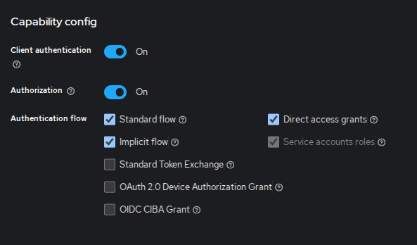

# Backend for frontends. Apigateway // ДЗ 

## Установка keykloack 

```shell
helm upgrade --install kc oci://registry-1.docker.io/bitnamicharts/keycloak --namespase otus --create-namespace 
```
   
Для доступа к административной панели

```shell
export HTTP_SERVICE_PORT=$(kubectl get --namespace otus -o jsonpath="{.spec.ports[?(@.name=='http')].port}" services kc-keycloak)
kubectl port-forward --namespace otus svc/kc-keycloak ${HTTP_SERVICE_PORT}:${HTTP_SERVICE_PORT} & echo "http://127.0.0.1:${HTTP_SERVICE_PORT}/"

echo "http://127.0.0.1:${HTTP_SERVICE_PORT}/"


helm --namespace otus upgrade kc bitnami/keycloak --set auth.adminPassword=KC_BOOTSTRAP_ADMIN_PASSWORD

echo Username: user
echo Password: $(kubectl get secret --namespace otus kc-keycloak -o jsonpath="{.data.admin-password}" | base64 -d)
```

FQDN внутри кластера, для подключения к нему сервисами:

    kc-keycloak.otus.svc.cluster.local (port 80)

## Создание клиента 

В веб-интерфейсе keycloak необходимо создать нового клиента с Client ID `otus`,
типом OpenID Connect и вкючеными опциями для авторизации, 
как указано на рисунке ниже:



Во вкладке Credentials можно будет получить Clent Secret, который потребуется 
для работы приложения.

Проверка, получения токена
```bash
CLIENT_ID=otus
ADMIN_USERNAME=user 
ADMIN_PASSWORD=$(kubectl get secret --namespace otus kc-keycloak -o jsonpath="{.data.admin-password}" | base64 -d)
CLIENT_SECRET=!! вставить значение из интерфейса !!
curl --location 'http://localhost:7000/realms/master/protocol/openid-connect/token' \
    --header 'Content-Type: application/x-www-form-urlencoded' \
    --data-urlencode "client_id=${CLIENT_ID}$" \
    --data-urlencode "client_secret=${CLIENT_SECRET}" \
    --data-urlencode "grant_type=password" \
    --data-urlencode "username=${USERNAME}" \
    --data-urlencode "password=${ADMIN_PASSWORD}"
```


## Cервис представляющий собой API Gateway 

Для работы приложения с API Keycloak требуется указать все эти параметры в конфигурации приложения, 
поэтому надо создать файл `charts/wsgi/values-private-data.yaml` следующего содержания: 

```yaml
keycloak:
  clientId: $CLIENT_ID
  clientSecret: $CLIENT_SECRET
  adminUsername: $ADMIN_USERNAME
  adminPassword: $ADMIN_PASSWORD
```


После чего выполнить инсталяцию приложения:
```bash
helm -n otus upgrade --install wsgi charts/wsgi/ \
    --values charts/wsgi/values.yaml \
    --values charts/wsgi/values-private-data.yaml
```

Для запуска тестового сценария из ДЗ нужно выполнить следующую команду: 

```bash
newman run postman_collection.json
```


