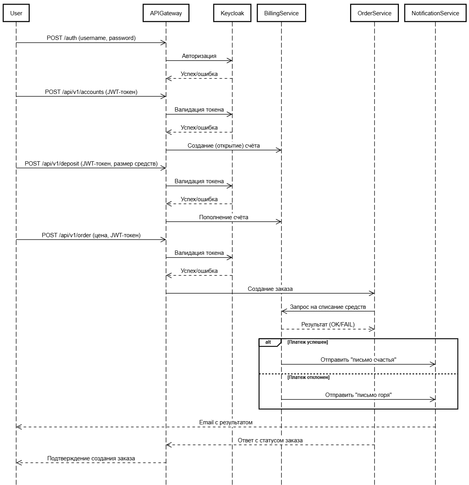

# RESTful // ДЗ 

Данная работа демонстрирует работу сервиса заказа.


Пользователь может создать заказ. У заказа есть параметр - цена заказа.
Заказ происходит в 2 этапа:

1. сначала снимаем деньги с пользователя с помощью сервиса биллинга
2. отсылаем пользователю сообщение на почту с результатами оформления заказа. 
Если биллинг подтвердил платеж, должно отослаться письмо счастья. Если нет, то письмо горя.


## Описание архитектурного решения и схема взаимодействия сервисов

Система состоит из пяти сервисов, взаимодействующих через API Gateway, 
который маршрутизирует запросы: /auth — в Keycloak (аутентификация), 
/api — в backend-сервисы. После авторизации пользователь создаёт счёт 
в Billing Service и пополняет баланс. При оформлении заказа через 
Order Service сервис проверяет и списывает средства через Billing Service, 
который также отправляет уведомления о платежах через Notification Service.

### Компоненты системы:

1. **API Gateway (WSGI)**   

    - Роль: Единая точка входа для всех HTTP-запросов.
    - Маршрутизация:
        - /auth → Keycloak Service (аутентификация и авторизация).
        - /api → Backend Services (основная бизнес-логика).
    - Технология: WSGI-совместимый сервер (Gunicorn + Flask/FastAPI).

2. **Keycloak Service**
    
    - Роль: Централизованное управление пользователями (аутентификация, авторизация, SSO).
    - Функции:
        - Генерация и проверка токенов доступа (JWT/OAuth2).
        - Хранение учетных записей и ролей пользователей.

3. **Billing Service**

    - Роль: Управление финансовыми операциями (списание средств, проверка баланса).
    - Функции:
        - Создание счёта пользователя (параметры: UUID пользователя)
        - Пополнение счёта (параметры: UUID пользователя, количество средств для пополнения)
    - Интеграция:
        - Получает запросы от Order Service на списание средств.
        - На основе результата инициирует уведомление через Notification Service (успех/недостаточно средств).

4. **Order Service**

    - Роль: Создание и управление заказами.
    - Логика работы:
        - Принимает запрос на создание заказа (параметры: наименование заказа, цена, UUID пользователя).
        - Вызывает Billing Service для списания средств.


5. **Notification Service**

    - Роль: Отправка уведомлений пользователям (email, SMS и т.д.).
    - Сценарии:
        - Письмо "счастья" при успешном платеже.
        - Письмо "горя" при ошибке списания.


### Схема взаимодействия сервисов




## Установка

Так как для реализации взаимоейдствия между сервисами используется механизм API Gateway,
то для работы данного задания потребуется выполнить установку сервисов 
[из моего предыдущего домашнего задания](../hw06-auth/README.md)

После чего выполнять инстралляцию сервисов billing, notification и order:

После чего выполнить инсталяцию приложения:
```bash
helm -n otus install billing charts/billing/ --values charts/billing/values.yaml

helm -n otus install notification charts/notification/ --values charts/notification/values.yaml

helm -n otus install order charts/order/ --values charts/order/values.yaml
```

## Проверка результатов

Для запуска тестового сценария из ДЗ нужно выполнить следующую команду: 

```bash
newman run postman_collection.json
```

