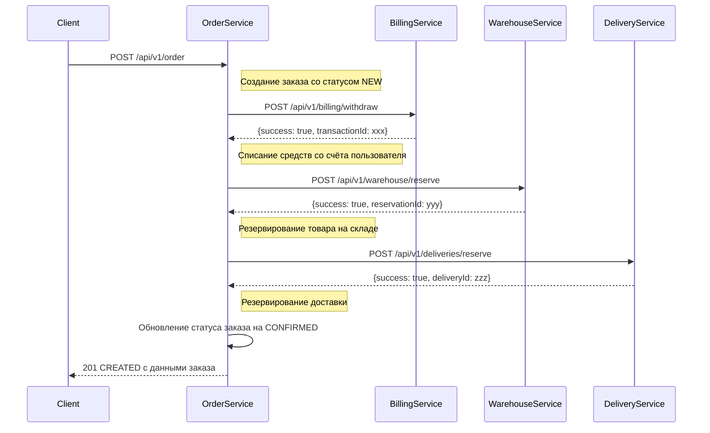
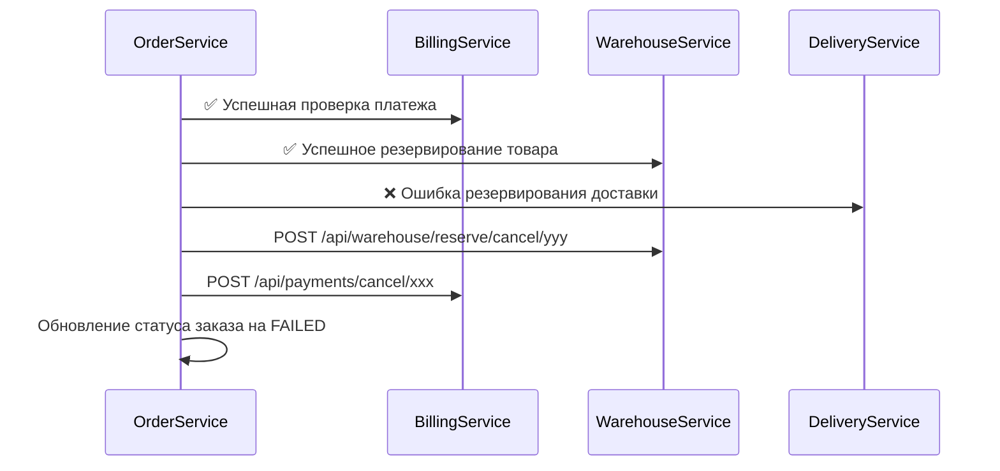

# Распределенные транзакции // ДЗ 

Данная работа демонстрирует реализацию распределенной транзакции в микросервисной архитектуре.

## Описание

Для демонстрации распределённой транзакции использовался паттерн Сага, на основе оркестратора в лице сервиса "Заказ" OrderService (из предыдущего ДЗ).

В дополнение к существующим сервисам, реализованым в предыдущих ДЗ, доработаны следующие сервисы:
 - "Платеж" (BillingService)
 - "Склад" (WarehouseService)
 - "Доставка" (DeliveryService)

Заказ происходит в 3 этапа:

1. Сначала снимаем деньги с пользователя с помощью сервиса биллинга
2. Выполняем резервирование товара на складе, если резервирование не удалось, 
выполняем откат опирации списания средств.
3. Если товар на складе был зарезервирован, выполняем резервирование времени в службе доставки. 
Если возникли ошибки, то возвращаем средства и отменяем резервирование товара на складе.

Взаимодействие сервиов для основного сценария представлено на следующей схеме:



Сценарий отката (компенсирующая транзакция):



Пользователь может создать заказ. У заказа есть набор параметров:
- наименование товара
- цена
- количество элементов в корзине
- адрес для доставки 
- предпочтительный интервал времени для доставки

Пример тела для POST запроса в формате JSON:

```json
{
    "userId": "{{userId}}",
    "items": [
      {
        "name": "Tomato",
        "productId": "{{$randomUUID}}",
        "quantity": 2,
        "price": 9.99
      },
      {
        "name": "Banana",
        "productId": "{{$randomUUID}}",
        "quantity": 3,
        "price": 5.70
      }
    ],
    "deliveryInfo": {
      "address": "Москва, ул. Примерная, д. 1",
      "preferredTimeSlot": "2024-01-15T14:00:00"
    }
}
```


## Установка приложения 

Но так как работа выполняется в рамках общего проекта Интернет-Магазин, часть сервисов была реализована в предыдущих ДЗ, поэтому в данном процессе зайдествованы 
и другие компоненты (сервисы авторизации, уведомления), подробное описание которых можно найти в файлах

- [../hw06-auth/README.md](../hw06-auth/README.md)
- [../hw07-restful/README.md](../hw07-restful/README.md)

Для простоты развёртывания я сделал копию helm чартов этих сервисов в папку данного ДЗ, поэтому для установки нужно выполнить следующую команду: 

```bash
helm -n otus install billing charts/billing/ --values charts/billing/values.yaml

helm -n otus install notification charts/notification/ --values charts/notification/values.yaml

helm -n otus install order charts/order/ --values charts/order/values.yaml

helm -n otus install delivery charts/delivery/ --values charts/delivery/values.yaml

helm -n otus install warehouse charts/warehouse/ --values charts/warehouse/values.yaml
```

## Тесты в postman

[Коллекция запросов к API для postman](postman_collection.json)

Запуск тестов можно выполнить командой 
```bash
newman run postman_collection.json
```
