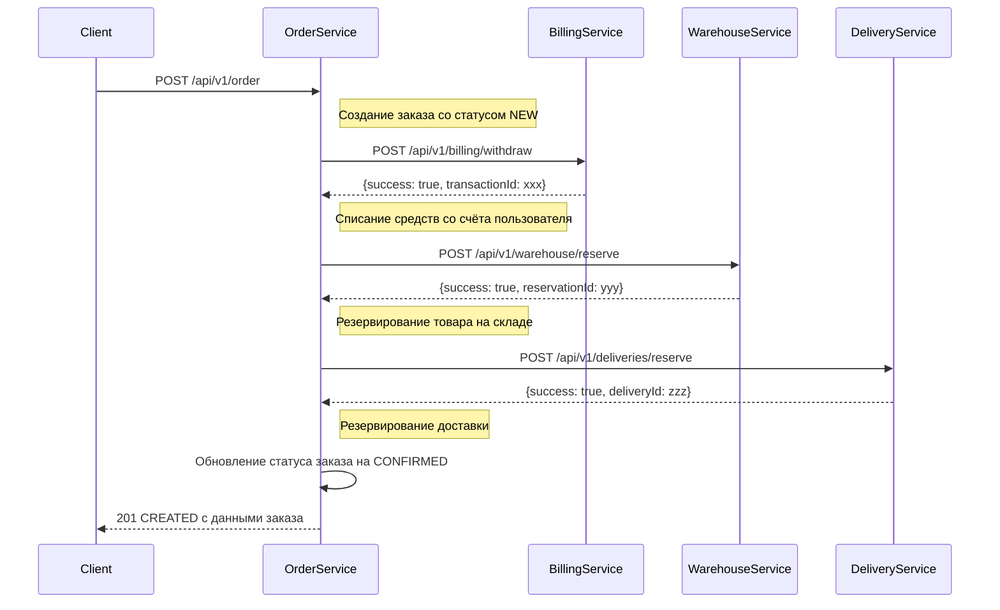
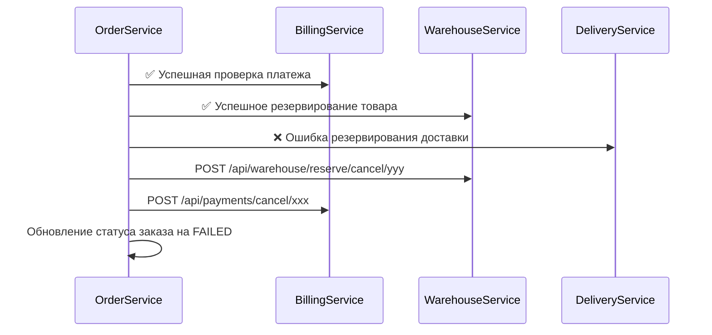

# Распределенные транзакции // ДЗ 

Данная работа демонстрирует реализацию распределенной транзакции в микросервисной архитектуре.

## Описание

Для демонстрации распределённой транзакции использовался паттерн Сага, на основе оркестратора в лице сервиса "Заказ" OrderService (из предыдущего ДЗ).

В дополнение к существующим сервисам, реализованым в предыдущих ДЗ, доработаны следующие сервисы:
 - "Платеж" (BillingService)
 - "Склад" (WarehouseService)
 - "Доставка" (DeliveryService)

Заказ происходит в 3 этапа:

1. Сначала снимаем деньги с пользователя с помощью сервиса биллинга
2. Выполняем резервирование товара на складе, если резервирование не удалось, 
выполняем откат опирации списания средств.
3. Если товар на складе был зарезервирован, выполняем резервирование времени в службе доставки. 
Если возникли ошибки, то возвращаем средства и отменяем резервирование товара на складе.

Взаимодействие сервиов для основного сценария представлено на следующей схеме:



Сценарий отката (компенсирующая транзакция):



Пользователь может создать заказ. У заказа есть набор параметров:
- наименование товара
- цена
- количество элементов в корзине
- адрес для доставки 
- предпочтительный интервал времени для доставки

Пример тела для POST запроса в формате JSON:

```json
{
    "userId": "{{userId}}",
    "items": [
      {
        "name": "Tomato",
        "quantity": 2,
        "price": 9.99
      },
      {
        "name": "Banana",
        "quantity": 3,
        "price": 5.70
      }
    ],
    "deliveryInfo": {
      "address": "Москва, ул. Примерная, д. 1",
      "preferredTimeSlot": "2024-01-15T14:00:00"
    }
}
```


## Установка приложения 

Но так как работа выполняется в рамках общего проекта Интернет-Магазин, часть сервисов была реализована в предыдущих ДЗ, поэтому в данном процессе зайдествованы 
и другие компоненты (сервисы авторизации, уведомления), подробное описание которых можно найти в файлах

- [../hw06-auth/README.md](../hw06-auth/README.md)
- [../hw07-restful/README.md](../hw07-restful/README.md)

Для простоты развёртывания я сделал копию helm чартов этих сервисов в папку данного ДЗ, поэтому для установки нужно выполнить следующую команду: 

```bash
helm -n otus install billing charts/billing/ --values charts/billing/values.yaml

helm -n otus install notification charts/notification/ --values charts/notification/values.yaml

helm -n otus install order charts/order/ --values charts/order/values.yaml

helm -n otus install delivery charts/delivery/ --values charts/delivery/values.yaml

helm -n otus install warehouse charts/warehouse/ --values charts/warehouse/values.yaml
```

## Тесты в postman

[Коллекция запросов к API для postman](postman_collection.json)

Запуск тестов можно выполнить командой 
```bash
newman run postman_collection.json
```

В случае успешного прохождения сценария, в логах сервиса order будет следующий вывод: 

```log
2025-08-26T15:06:43.485Z  INFO 1 --- [nio-8082-exec-6] ru.otus.service.OrderService             : New order created: Order(id=6cc3cc5a-5bcb-4e42-91cf-d90bcdf5ff8b, price=37.08, userId=8391d405-7660-4e7f-b9cd-306218159288, number=1685-850-627 04, description=Products: Tomato, Banana, status=NEW, errorMessage=null, createdAt=2025-08-26T15:06:43.484753311, updatedAt=2025-08-26T15:06:43.484766019, version=0)
2025-08-26T15:06:43.486Z DEBUG 1 --- [nio-8082-exec-6] ru.otus.service.OrderService             : Make URL for request to service: http://billing:8080/api/v1/billing/ withdraw
2025-08-26T15:06:43.486Z DEBUG 1 --- [nio-8082-exec-6] ru.otus.service.OrderService             : URL for payment: http://billing:8080/api/v1/billing/withdraw
2025-08-26T15:06:43.508Z DEBUG 1 --- [nio-8082-exec-6] ru.otus.service.OrderService             : 1. Payment result: SagaStepResult(success=true, message=Withdrawal successful, transactionId=09f44f79-0497-472d-96d6-c346666e1e57 , data=null)
2025-08-26T15:06:43.508Z DEBUG 1 --- [nio-8082-exec-6] ru.otus.service.OrderService             : Make URL for request to service: http://warehouse:8083/api/v1/warehouse/reserve
2025-08-26T15:06:43.508Z DEBUG 1 --- [nio-8082-exec-6] ru.otus.service.OrderService             : URL for stock item reserve: http://warehouse:8083/api/v1/warehouse/reserve
2025-08-26T15:06:43.522Z DEBUG 1 --- [nio-8082-exec-6] ru.otus.service.OrderService             : 2. Warehouse reservation result: SagaStepResult(success=true, message=Reservation successful, transactionId=e0e2c2b7-7e31-4ebf-bf90-6175abd0b028, data=null)
2025-08-26T15:06:43.522Z DEBUG 1 --- [nio-8082-exec-6] ru.otus.service.OrderService             : Make URL for request to service: http://delivery:8085/api/v1/deliveries/reserve
2025-08-26T15:06:43.523Z DEBUG 1 --- [nio-8082-exec-6] ru.otus.service.OrderService             : URL for delivery reserve: http://delivery:8085/api/v1/deliveries/reserve
2025-08-26T15:06:43.530Z DEBUG 1 --- [nio-8082-exec-6] ru.otus.service.OrderService             : 3. Delivery reservation result: SagaStepResult(success=true, message=Delivery reserved, transactionId=7a65a0ba-d270-4c17-800f-a3b8d7ff6667, data=null)
2025-08-26T15:06:43.531Z  INFO 1 --- [nio-8082-exec-6] ru.otus.service.OrderService             : Order processing No.1685-850-627 04 (UUID: 6cc3cc5a-5bcb-4e42-91cf-d90bcdf5ff8b) completed successfully!
```

Из которого видны последовательные вызовы всех сервисов.

Для демонстрации сценария отката, нужно временно выключить один из промежуточных сервисов, warehouse или delivery, и повторить тесты.

Например, при выключенном сервисе warehouse, в логах будет следующая картина:

```log
[...omitted...]
2025-08-26T21:30:54.978Z DEBUG 1 --- [nio-8082-exec-9] ru.otus.service.OrderService             : 2. Warehouse reservation result: SagaStepResult(success=false, message=Warehouse service error: I/O error on POST request for "http://warehouse:8083/api/v1/warehouse/reserve": Connection refused, transactionId=null, data=null)
2025-08-26T21:30:54.978Z DEBUG 1 --- [nio-8082-exec-9] ru.otus.service.OrderService             : Make URL for request to service: http://billing:8080/api/v1/billing/cancel/62c369e2-81fd-4d18-b4c2-19f2bda2afe6
2025-08-26T21:30:54.978Z DEBUG 1 --- [nio-8082-exec-9] ru.otus.service.OrderService             : URL to cancel payment: http://billing:8080/api/v1/billing/cancel/62c369e2-81fd-4d18-b4c2-19f2bda2afe6
2025-08-26T21:30:55.107Z  INFO 1 --- [nio-8082-exec-9] ru.otus.service.OrderService             : Payment for order 1fd0d96b-6432-487d-8a54-0295cbed6851 has been cancelled.
2025-08-26T21:30:55.108Z ERROR 1 --- [nio-8082-exec-9] ru.otus.service.OrderService             : Order processing No.7945-013-762 48 (UUID: 1fd0d96b-6432-487d-8a54-0295cbed6851) FAILED.
[...omitted...]
```

Что демонстрирует, успешный возврат денег на счёт пользователя. 

Дополнительно, в колекции тестов postman-а есть тест для проверки баланса, с помощью которого также можно убедиться, в том что счёт не изменился: 

```bash
→ Check account balance
  GET http://arch.homework/api/v1/billing/accounts/8391d405-7660-4e7f-b9cd-306218159288 [200 OK, 233B, 9ms]
  ┌
  │ { id: 3, userId: '8391d405-7660-4e7f-b9cd-306218159288', email: 'gunner4@yahoo.com', balance: 62.92 }
  └
  ✓  Balance is correct
```