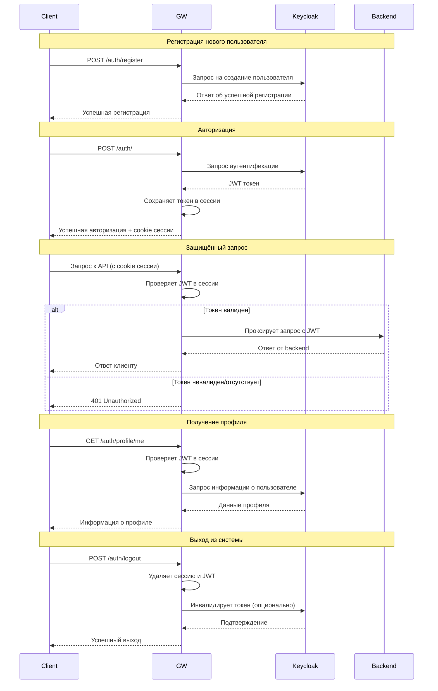
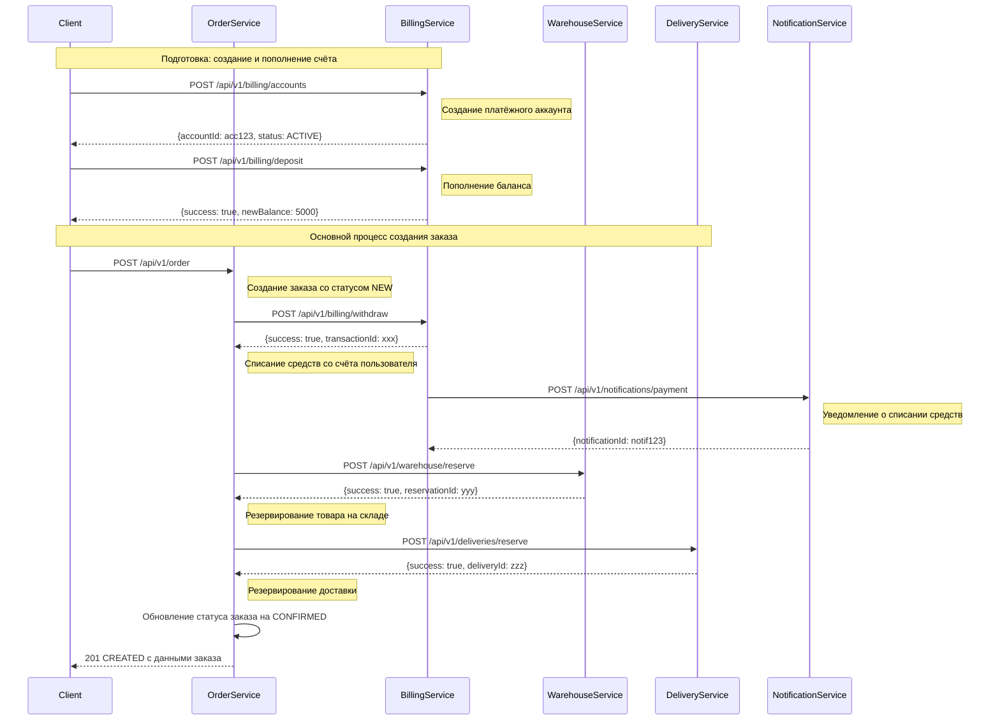
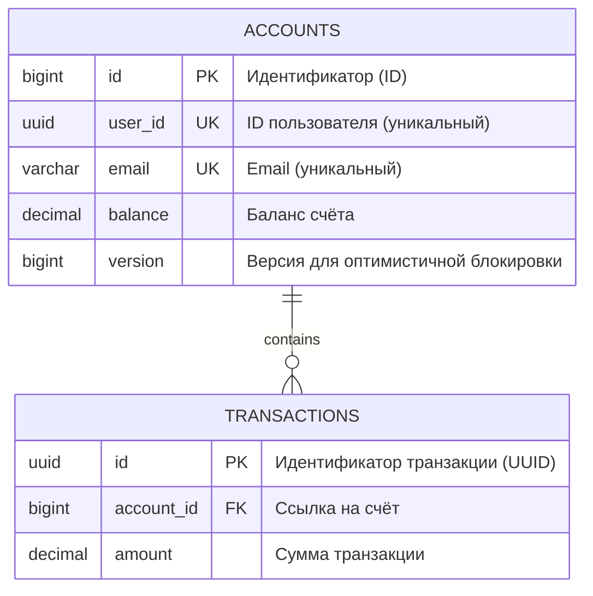
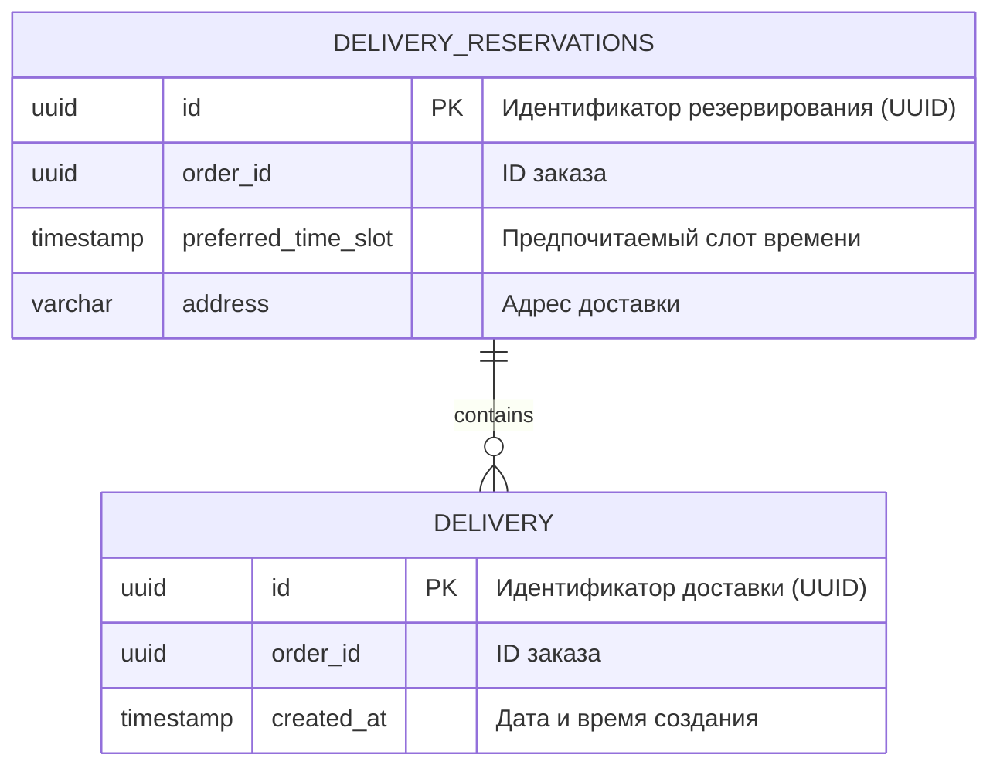
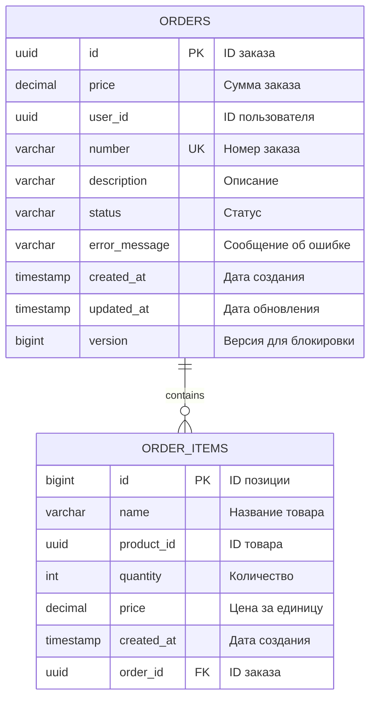
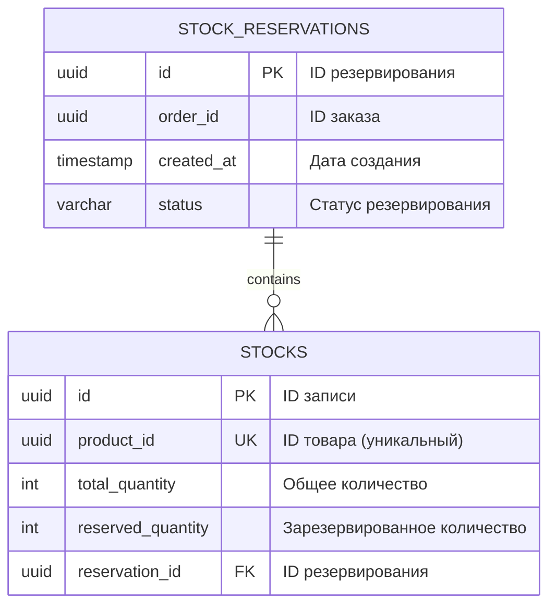

# Проектная работа

Тема: **Интернет-магазин**

Используемые технологии и паттерны:

1. Общий стек технологий: Java, Pyhton, H2, JPA Hibernate
2. Паттерны: API Gateway, REST API, Saga, Transaction orchestration, Idempotency, Observability
3. Перечень используемых инструментов: Kubernetes, Helm, Prometheus, Grafana, Keyclock, Postman, newman 


## Архитектура реализации

Участники процесса

 - **Клиент** - покупатель, инициирующий заказ
 - **OrderService** - оркестратор процесса создания заказа
 - **BillingService** - управление платежами и счетами
 - **WarehouseService** - управление складскими запасами
 - **DeliveryService** - организация доставки
 - **NotificationService** - отправка уведомлений

### Схема аутентификации




### Диаграмма последовательности для ключевого сценария



На данной схеме представлен полный цикл обработки заказа в системе электронной коммерции.

Процесс начинается с подготовки: пользователь создает платёжный аккаунт и пополняет баланс.

При оформлении заказа система последовательно выполняет критически важные операции: 
- списание средств с резервированием платежа, 
- автоматическую отправку уведомления о списании, 
- резервирование товара на складе 
- организацию доставки

Каждый этап выполняется строго после успешного завершения предыдущего, что обеспечивает транзакционную целостность процесса. 
Финализация заказа происходит только после подтверждения всех операций, гарантируя клиенту надёжность выполнения его заказа.

Схема демонстрирует слаженное взаимодействие шести независимых сервисов, 
каждый из которых отвечает за свою зону ответственности в рамках единого бизнес-процесса.


### Описание межсервисного взаимодействия 


### Схема хранения данных

У каждого сервиса своя БД, схемы которых представлены ниже. 

В качестве СУБД используется inmemory DB H2, просто для упрощения разработки 
и скорости разворачивания. Но переключение на любую другую реализацию 
реляционной БД не вызывает проблем, так как всё взаимодействие с хранилищем 
просиходит через ORM на базе Hibernate. 

#### Billing Service



#### Delivery Service


#### Order Service


#### Warehouse Service


### Saga. Ключевые аспекты реализации

**Order Service (Orchestrator)**

 - Управляет workflow всей саги
 - Выполняет последовательные вызовы к другим сервисам
 - Обрабатывает ошибки и запускает компенсирующие транзакции
 - Обновляет статус заказа на каждом этапе

**Сервис-участники (Participants)**

 - Billing Service: Сервис проведения платежных операций
 - Warehouse Service: Резервирование товаров на складе
 - Delivery Service: Бронирование временного слота доставки
 - Notification Service: Сервис уведомления пользователя о состоянии заказа
 
**Механизм компенсации**

Каждый сервис предоставляет:
 - Основную операцию (например, /reserve)
 - Компенсирующую операцию (например, /reserve/cancel/{id})


### DTO для межсервисного взаимодействия

```java
@Data
public class SagaStepResult {
    private boolean success;
    private String message;
    private UUID transactionId; // ID для компенсации
    private Object data;
}
```

### Жизненный цикл заказа

```java
public enum OrderStatus {
    NEW,             // Новый заказ (начало саги)
    PROCESSING,      // В обработке
    PAID,            // Оплачен
    ITEMS_RESERVED,  // Товары зарезервированы
    DELIVERY_BOOKED, // Доставка забронирована
    CONFIRMED,       // Заказ обработан
    FAILED           // Ошибка при обработке
}
```

### Механизм отката

```java
SagaStepResult warehouseResult = reserveItems(orderId, request.getItems());
log.debug( "2. Warehouse reservation result: {}", warehouseResult);
if (warehouseResult.isSuccess()) {
    updateOrderStatus(orderId, OrderStatus.ITEMS_RESERVED, null);
} else {
    cancelPayment(orderId, paymentResult.getTransactionId());
    throw new ResponseStatusException(HttpStatus.INTERNAL_SERVER_ERROR, "Warehouse reservation failed: " + warehouseResult.getMessage());
}

SagaStepResult deliveryResult = reserveDelivery(orderId, request.getDeliveryInfo());
log.debug( "3. Delivery reservation result: {}", deliveryResult);
if (deliveryResult.isSuccess()) {
    updateOrderStatus(orderId, OrderStatus.DELIVERY_BOOKED, null);
} else {
    cancelPayment(orderId, paymentResult.getTransactionId());
    cancelReservation(orderId, warehouseResult.getTransactionId());
    throw new ResponseStatusException(HttpStatus.INTERNAL_SERVER_ERROR, "Delivery reservation failed: " + deliveryResult.getMessage());
}
```


### Гарантии согласованности

1. **Атомарность на уровне бизнес-процесса** - либо все шаги успешны, либо все откатываются
2. **Идемпотентность операций** - повторные вызовы компенсации безопасны
3. **Транзакционность данных** - каждый сервис управляет своей БД атомарно
4. **Наблюдаемость** - каждый этап логируется и может быть аудирован


### Идемпотентность 

Реализован механизм гарантированной идемпотентности на основе уникального ключа, который клиент передает при каждом запросе создания заказа. 

Сервер кэширует результаты обработки запросов и при повторных запросах с тем же ключом возвращает результат из кэша без повторного выполнения бизнес-логики.

Дополнительно проверяется наличие существующего заказа в БД по бизнес-правилам: 
тот же пользователь + похожие товары + пятиминутный интервал времени, в котором похожий заказ мог бы быть сделан.

1. В случае, если заказ успешно созадётся в первый раз, сервер возвращает код 201 (CREATED). 
2. При нахождении запроса на заказ в кеше по ключу, сервер вернёт код 200 (OK). То есть это показывает, что на сервере не был создан новый ресурс (в виде записи в БД). 
3. А в случае нахождения похожего заказа в БД, сервер ответит ошибкой 409 (CONFLICTED), но всё равно вернёт найденный заказ в теле ответа.


